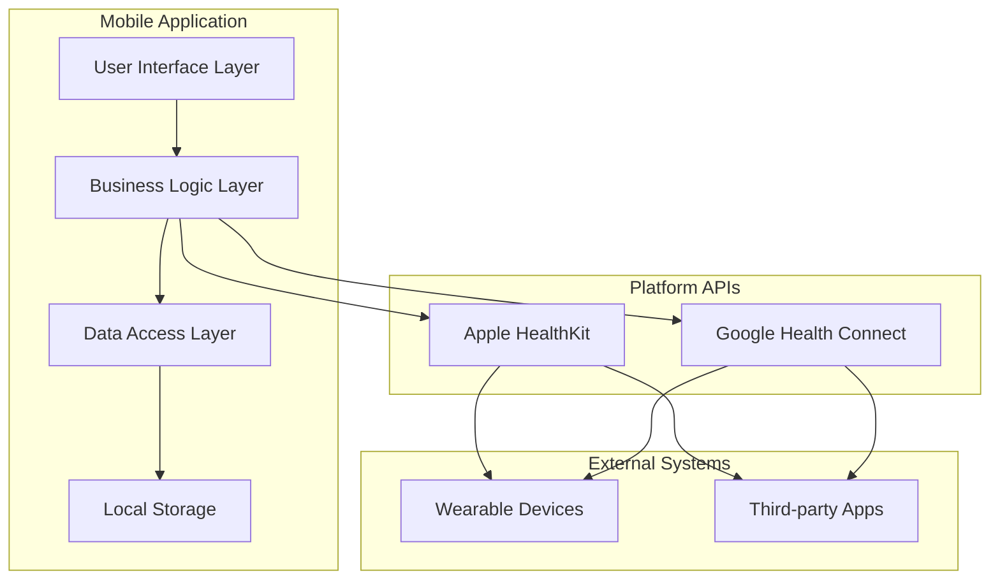

# Design Document: Health Tracker

## Overview

The Health Tracker is a cross-platform mobile application that provides comprehensive exercise tracking through both manual logging and automatic synchronization with platform health APIs. The system addresses the challenge of maintaining accurate health data by detecting and resolving conflicts between user-entered data and automatically synced information from Google Health Connect and Apple HealthKit.

The application follows a mobile-first architecture with local data storage and platform-specific health API integration. Key design principles include data integrity, user control over conflict resolution, and seamless cross-platform functionality.

## Architecture

### High-Level Architecture



### Technology Stack

**Cross-Platform Framework**: React Native
- Chosen for its mature ecosystem, strong community support, and excellent platform API integration capabilities
- Provides near-native performance while maintaining a single codebase
- Established libraries for health platform integration

**Local Storage**: SQLite with React Native SQLite Storage
- Provides reliable offline functionality
- Supports complex queries for conflict detection
- Maintains data integrity with ACID transactions

**Platform Integration**:
- iOS: Apple HealthKit via react-native-health
- Android: Google Health Connect via react-native-health-connect

## Components and Interfaces

### Core Components

#### 1. Exercise Logger Component
**Responsibility**: Handle manual exercise entry and validation
**Interface**:
```typescript
interface ExerciseLogger {
  validateExerciseData(data: ExerciseInput): ValidationResult
  saveManualLog(exercise: ExerciseData): Promise<Exercise_Record>
  getValidationRules(): ValidationRules
}

interface ExerciseInput {
  name: string
  startTime: Date
  duration: number // minutes
}
```

#### 2. Health Platform Sync Component
**Responsibility**: Manage synchronization with platform health APIs
**Interface**:
```typescript
interface HealthPlatformSync {
  requestPermissions(): Promise<PermissionStatus>
  syncExerciseData(): Promise<SyncResult>
  syncStepData(): Promise<SyncResult>
  handleSyncFailure(error: SyncError): Promise<RetryResult>
}

interface SyncResult {
  newRecords: Exercise_Record[]
  conflicts: Conflict[]
  lastSyncTimestamp: Date
}
```

#### 3. Conflict Detection Engine
**Responsibility**: Identify overlapping data between manual logs and synced data
**Interface**:
```typescript
interface ConflictDetector {
  detectConflicts(manualLogs: Exercise_Record[], syncedData: Exercise_Record[]): Conflict[]
  analyzeTimeOverlap(record1: Exercise_Record, record2: Exercise_Record): OverlapResult
  categorizeConflict(conflict: Conflict): ConflictType
}

interface Conflict {
  id: string
  manualRecord: Exercise_Record
  syncedRecord: Exercise_Record
  overlapDuration: number
  conflictType: ConflictType
  detectedAt: Date
}
```

#### 4. Conflict Resolution Manager
**Responsibility**: Present conflicts to users and handle resolution choices
**Interface**:
```typescript
interface ConflictResolver {
  presentConflictToUser(conflict: Conflict): Promise<ResolutionChoice>
  applyResolution(conflict: Conflict, choice: ResolutionChoice): Promise<void>
  createAuditRecord(resolution: ConflictResolution): Promise<void>
  undoResolution(auditId: string): Promise<void>
}

enum ResolutionChoice {
  KEEP_MANUAL = 'keep_manual',
  KEEP_SYNCED = 'keep_synced',
  MERGE_RECORDS = 'merge_records',
  KEEP_BOTH = 'keep_both'
}
```

#### 5. Data Storage Manager
**Responsibility**: Handle all local data persistence and retrieval
**Interface**:
```typescript
interface DataStorageManager {
  saveExerciseRecord(record: Exercise_Record): Promise<void>
  getExerciseHistory(dateRange: DateRange): Promise<Exercise_Record[]>
  updateRecord(id: string, updates: Partial<Exercise_Record>): Promise<void>
  deleteRecord(id: string): Promise<void>
  getAuditTrail(limit: number): Promise<AuditRecord[]>
}
```

### Platform-Specific Adapters

#### iOS HealthKit Adapter
```typescript
interface HealthKitAdapter extends HealthPlatformSync {
  requestHealthKitPermissions(): Promise<PermissionStatus>
  queryWorkouts(dateRange: DateRange): Promise<HKWorkout[]>
  queryStepCount(dateRange: DateRange): Promise<HKQuantitySample[]>
  convertHKWorkoutToExerciseRecord(workout: HKWorkout): Exercise_Record
}
```

#### Android Health Connect Adapter
```typescript
interface HealthConnectAdapter extends HealthPlatformSync {
  requestHealthConnectPermissions(): Promise<PermissionStatus>
  readExerciseSessions(dateRange: DateRange): Promise<ExerciseSession[]>
  readStepsData(dateRange: DateRange): Promise<StepsRecord[]>
  convertSessionToExerciseRecord(session: ExerciseSession): Exercise_Record
}
```

## Data Models

### Core Data Structures

#### Exercise_Record
```typescript
interface Exercise_Record {
  id: string
  name: string
  startTime: Date
  duration: number // minutes
  source: DataSource
  platform?: HealthPlatform
  metadata: ExerciseMetadata
  createdAt: Date
  updatedAt: Date
}

enum DataSource {
  MANUAL = 'manual',
  SYNCED = 'synced'
}

enum HealthPlatform {
  APPLE_HEALTHKIT = 'apple_healthkit',
  GOOGLE_HEALTH_CONNECT = 'google_health_connect'
}

interface ExerciseMetadata {
  calories?: number
  heartRate?: number
  deviceId?: string
  appSource?: string
}
```

#### Manual_Log
```typescript
interface Manual_Log extends Exercise_Record {
  source: DataSource.MANUAL
  validationStatus: ValidationStatus
  userNotes?: string
}

enum ValidationStatus {
  VALID = 'valid',
  INVALID = 'invalid',
  PENDING = 'pending'
}
```

#### Synced_Data
```typescript
interface Synced_Data extends Exercise_Record {
  source: DataSource.SYNCED
  platform: HealthPlatform
  originalId: string // ID from health platform
  syncedAt: Date
  confidence: number // 0-1 confidence score
}
```

#### Conflict Resolution Models
```typescript
interface ConflictResolution {
  id: string
  conflictId: string
  resolutionChoice: ResolutionChoice
  resolvedAt: Date
  beforeState: ConflictState
  afterState: ConflictState
  userNotes?: string
}

interface ConflictState {
  manualRecord?: Exercise_Record
  syncedRecord?: Exercise_Record
  mergedRecord?: Exercise_Record
}

interface AuditRecord {
  id: string
  action: AuditAction
  timestamp: Date
  recordId: string
  beforeData?: any
  afterData?: any
  metadata: AuditMetadata
}

enum AuditAction {
  CONFLICT_RESOLVED = 'conflict_resolved',
  RECORD_CREATED = 'record_created',
  RECORD_UPDATED = 'record_updated',
  RECORD_DELETED = 'record_deleted',
  RESOLUTION_UNDONE = 'resolution_undone'
}
```

### Database Schema

```sql
-- Exercise Records Table
CREATE TABLE exercise_records (
  id TEXT PRIMARY KEY,
  name TEXT NOT NULL,
  start_time INTEGER NOT NULL,
  duration INTEGER NOT NULL,
  source TEXT NOT NULL CHECK (source IN ('manual', 'synced')),
  platform TEXT CHECK (platform IN ('apple_healthkit', 'google_health_connect')),
  metadata TEXT, -- JSON blob
  created_at INTEGER NOT NULL,
  updated_at INTEGER NOT NULL
);

-- Conflicts Table
CREATE TABLE conflicts (
  id TEXT PRIMARY KEY,
  manual_record_id TEXT NOT NULL,
  synced_record_id TEXT NOT NULL,
  overlap_duration INTEGER NOT NULL,
  conflict_type TEXT NOT NULL,
  status TEXT NOT NULL DEFAULT 'pending',
  detected_at INTEGER NOT NULL,
  FOREIGN KEY (manual_record_id) REFERENCES exercise_records(id),
  FOREIGN KEY (synced_record_id) REFERENCES exercise_records(id)
);

-- Audit Trail Table
CREATE TABLE audit_records (
  id TEXT PRIMARY KEY,
  action TEXT NOT NULL,
  timestamp INTEGER NOT NULL,
  record_id TEXT,
  before_data TEXT, -- JSON blob
  after_data TEXT,  -- JSON blob
  metadata TEXT     -- JSON blob
);

-- Indexes for performance
CREATE INDEX idx_exercise_records_start_time ON exercise_records(start_time);
CREATE INDEX idx_exercise_records_source ON exercise_records(source);
CREATE INDEX idx_conflicts_status ON conflicts(status);
CREATE INDEX idx_audit_records_timestamp ON audit_records(timestamp);
```

## Correctness Properties

*A property is a characteristic or behavior that should hold true across all valid executions of a system—essentially, a formal statement about what the system should do. Properties serve as the bridge between human-readable specifications and machine-verifiable correctness guarantees.*

### Property 1: Manual Exercise Data Persistence
*For any* valid exercise data (non-empty name, valid time format, positive duration), saving it as a Manual_Log should result in the data being stored locally with a timestamp and retrievable from storage.
**Validates: Requirements 1.2**

### Property 2: Input Validation Rejection
*For any* invalid exercise input (incomplete data, invalid time format, or non-positive duration), the system should reject the submission and prevent data storage.
**Validates: Requirements 1.3, 1.4, 1.5**

### Property 3: Health Platform Sync Behavior
*For any* granted permissions and available health platform data, the system should successfully fetch and store the data with appropriate metadata and platform attribution.
**Validates: Requirements 2.2, 2.3**

### Property 4: Sync Error Handling
*For any* sync failure due to network issues or platform unavailability, the system should either retry with exponential backoff or continue functioning with manual logging only.
**Validates: Requirements 2.4, 2.5**

### Property 5: Cross-Platform Data Consistency
*For any* synced data from different health platforms, the system should format and display the data consistently regardless of the source platform.
**Validates: Requirements 3.4**

### Property 6: Conflict Detection Accuracy
*For any* Manual_Log and Synced_Data that overlap in time, the system should detect and flag them as potential conflicts.
**Validates: Requirements 4.1**

### Property 7: Conflict Resolution Completeness
*For any* detected conflict and user resolution choice, the system should properly apply the resolution, update records, and remove conflict indicators.
**Validates: Requirements 4.4, 4.5**

### Property 8: Exercise Record Display Requirements
*For any* exercise record being displayed, the system should show all required fields (name, time, duration) and clearly indicate the data source for synced records.
**Validates: Requirements 5.1, 5.5**

### Property 9: Exercise History Organization
*For any* collection of exercise records, the system should organize them chronologically with proper date grouping when displaying history.
**Validates: Requirements 5.2**

### Property 10: Record Modification Operations
*For any* Manual_Log edit or Exercise_Record deletion operation, the system should properly update storage and reflect changes in the display.
**Validates: Requirements 5.3, 5.4**

### Property 11: Audit Trail Completeness
*For any* conflict resolution, the system should create a comprehensive audit record containing timestamp, conflict details, resolution action, and chosen data source.
**Validates: Requirements 6.1, 6.2, 6.3**

### Property 12: Audit Trail Management
*For any* sequence of conflict resolutions, the system should maintain a rolling history of the last 100 resolutions and support undo operations using audit data.
**Validates: Requirements 6.4, 6.5**

### Property 13: Permission Management
*For any* health platform permission request, the system should provide explanations for each permission and support selective opt-in functionality.
**Validates: Requirements 7.2**

### Property 14: Data Purge Completeness
*For any* account purge operation, the system should remove all Exercise_Record, Manual_Log, Synced_Data, and audit trails, then reset to initial state with confirmation.
**Validates: Requirements 7.3, 7.4, 7.5**

### Property 15: Local Storage Persistence
*For any* exercise data (entered or synced), the system should store it locally and make it available for offline access and immediate loading on app startup.
**Validates: Requirements 8.1, 8.4**

### Property 16: Offline Functionality
*For any* offline state, the system should continue functioning with local data and automatically sync when connectivity is restored.
**Validates: Requirements 8.2**

### Property 17: Conflict Preservation During Sync
*For any* data conflicts that occur during synchronization, the system should preserve both versions until explicit user resolution.
**Validates: Requirements 8.3**

### Property 18: Duplicate Prevention
*For any* sync operation with Health_Platform, the system should avoid creating duplicate entries by checking timestamps and exercise details.
**Validates: Requirements 8.5**

## Error Handling

### Sync Failures
- **Network Connectivity**: Implement exponential backoff retry mechanism with maximum retry limits
- **Platform API Errors**: Log errors, notify users, and continue with manual logging functionality
- **Permission Denials**: Gracefully degrade to manual-only mode with clear user messaging

### Data Validation Errors
- **Input Validation**: Provide immediate feedback with specific error messages for each validation rule
- **Data Corruption**: Implement data integrity checks and recovery mechanisms
- **Storage Failures**: Implement backup storage strategies and user notification systems

### Conflict Resolution Errors
- **Resolution Failures**: Maintain original conflict state and allow retry
- **Audit Trail Corruption**: Implement audit data validation and recovery
- **Undo Operation Failures**: Preserve audit history and provide alternative resolution paths

### Platform-Specific Errors
- **iOS HealthKit Errors**: Handle authorization changes, data access restrictions, and API deprecations
- **Android Health Connect Errors**: Handle permission revocations, API version changes, and data format variations

## Testing Strategy

### Dual Testing Approach
The system will employ both unit testing and property-based testing to ensure comprehensive coverage:

**Unit Tests**: Verify specific examples, edge cases, and error conditions
- Integration points between health platform APIs and internal components
- Specific conflict resolution scenarios
- Error handling for network failures and permission denials
- Platform-specific behavior validation

**Property Tests**: Verify universal properties across all inputs
- Data validation rules across all possible input combinations
- Conflict detection accuracy across various time overlap scenarios
- Sync behavior consistency across different data volumes and types
- Audit trail completeness across all resolution types

### Property-Based Testing Configuration
- **Framework**: fast-check for React Native/TypeScript
- **Test Iterations**: Minimum 100 iterations per property test
- **Test Tagging**: Each property test must reference its design document property using the format: **Feature: health-tracker, Property {number}: {property_text}**

### Testing Coverage Requirements
- **Core Logic**: All business logic components must have both unit and property tests
- **Platform Integration**: Mock-based unit tests for platform API interactions
- **Data Persistence**: Property tests for all CRUD operations on local storage
- **Conflict Resolution**: Comprehensive property tests for all resolution scenarios
- **Error Conditions**: Unit tests for all identified error handling paths

### Test Data Management
- **Synthetic Data Generation**: Use property test generators for realistic exercise data
- **Platform Data Mocking**: Create representative mock data for both iOS and Android health platforms
- **Conflict Scenarios**: Generate diverse conflict scenarios for comprehensive testing
- **Edge Cases**: Include boundary conditions for time overlaps, data limits, and validation rules